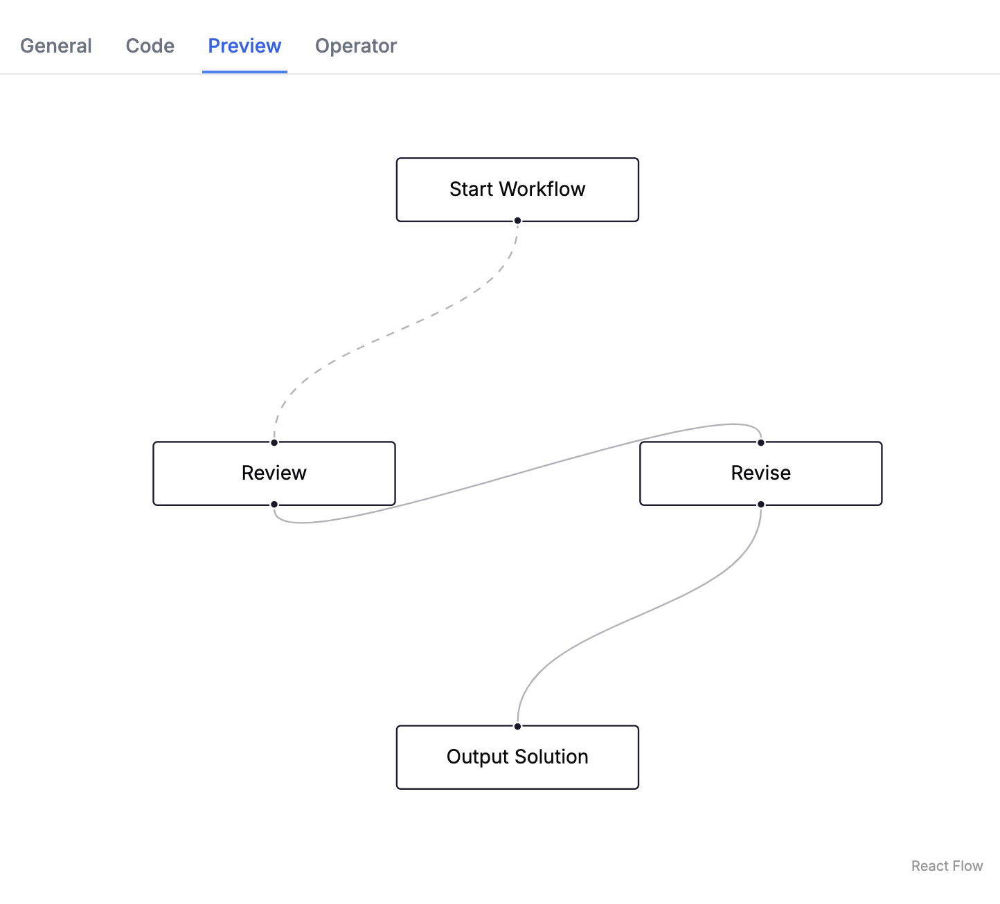
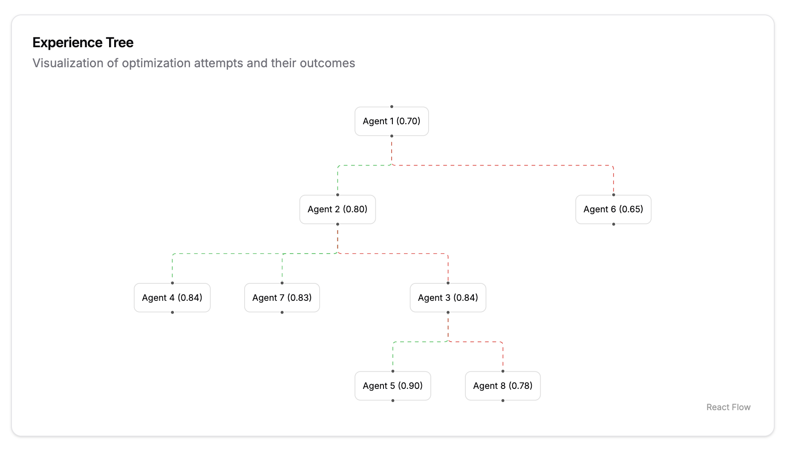
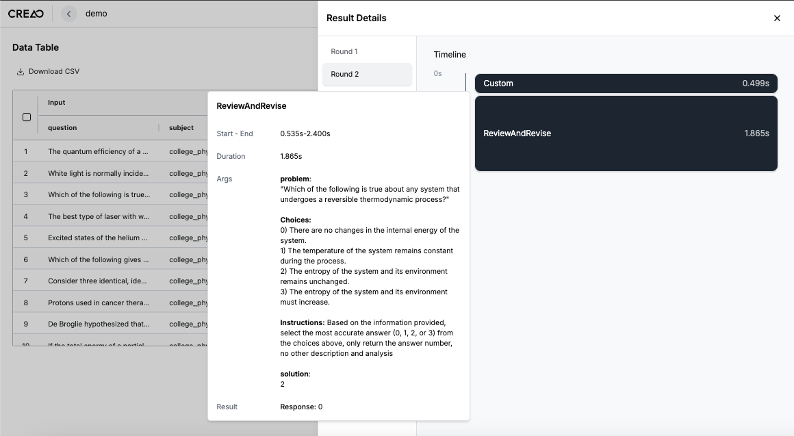

# Key Features

Creao AI helps you create, optimize, and deploy agentic workflows autonomously. Below, we highlight the key features that enable you to do just that.

## Workflow Creation

- **Effortless Workflow Setup**: Upload a dataset, provide a prompt, and let the Meta Agent handle the complexities of generating and executing agents.
- **Responsive to Changes**: Update your workflow any time to integrate new data, accommodate shifting tasks, and meet fresh requirements, from creation to deployment.

## Agent Observability

Understanding and refining workflows is key to unlocking their full potential. Creao AI equips you with the tools for visibility into every facet of the process.

- **Agent Details**: Take a deeper look into the agent's attributes, structure, and code.

  - Access essential metrics such as scores, modifications, and evaluation type.
  - Inspect the agent’s code and visualize its structure.
  - Explore the operators driving your agent’s capabilities.

  

- **Agent Planning Analysis Tree**: A detailed evolution tree of the agent generation process.

  - **Node Insights**: View modifications made to the agent and its performance scores.
  - **Edge Insights**: Follow the lineage between parent and child agents—green edges for progress, red for setbacks.
  - **Performance Graph**: Track agent performance across iterations.

  

- **Agent Run Replay**: Replay any agent's execution to dissect its behavior step-by-step.

  - Review final outputs and AI responses
  - Gain clarity on how decisions were made at each stage.
  - Understand the agent's behavior for different scenarios.

- **Agent Run Info**: Examine detailed timing and execution metrics for each agent run.

  - **Runtime Analysis**: Track precise execution durations for each round.
  - **Execution Timeline**: Monitor start and end timestamps of each phase.
  - **Input Details**: Review the exact inputs provided to the agent.
  - **Output Results**: See the agent's responses and final outputs.

  

## Instant Deployment

Coming soon! 👀
