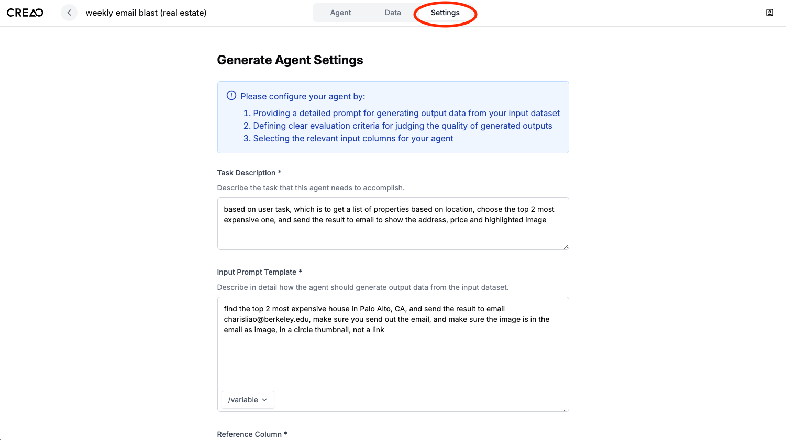
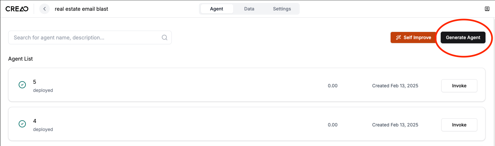
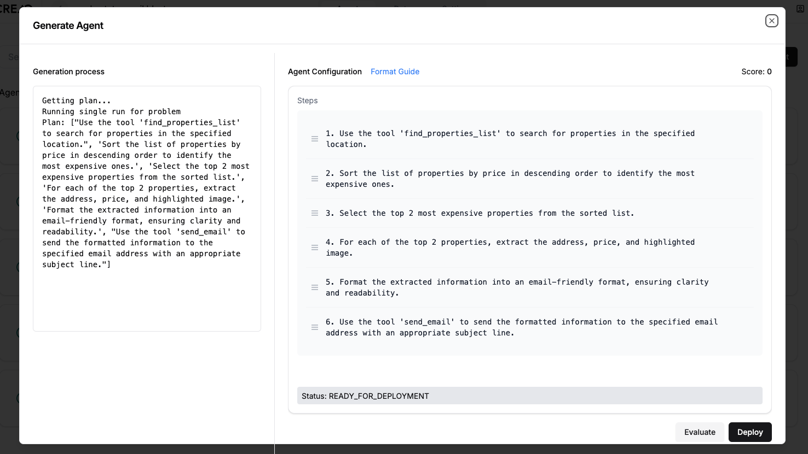

# Creating Your First Workflow

Now that your account is set up, let's create your first workflow on our Creao AI platform. This guide will walk you through the process step by step.

---

## 1. Navigate to Creao Dashboard 🖥️

1. Log in to your account at [Creao AI](https://creao-remix.vercel.app/login), then click "upload your dataset".

> **P.S.** You should have received a Creao account link from one of our team members. If not, please join the "wait list." We do not provide public usage at the moment, and we apologize for the inconvenience.

---

## 2. Upload Your Dataset 📂

- **Upload Your Dataset**:

  

  1. Click **Upload Your Dataset**.
  2. Enter your project name and project description.
  3. Upload your dataset by clicking **Choose File**.
  4. Click **Create Project** to finish.

---

## 3. Insert prompts for agent generation 🤖

Once you've created your project, you will be led to the Data Table page that shows your dataset. Next, edit settings for your workflow.

1. Click **Settings** in the top navigation bar.
2. Input the **Task Description**.
3. Enter the **Input Prompt Template**.
4. Select the **Reference Column**.
5. Input the **Result Format**.
6. Select the **Tools**.
7. Select the **Knowledge**.
8. Click **Save Settings** to finish.

---

## 4. Generate Your Next Agent ⚙️

After settings are saved, you will be led to the Agents page. Click **Generate Agent** to create your first agent.

Generating an agent will take a few minutes. Once the generation is complete, you will see your new agent in the Agents page.

Generate as many agents as you need.

---

## 5. View Generation Process and Execution Plan Details 🔍

After clicking **Generate Agent**, a modal will pop up to show you the generation process and execution plan details. Reasoning and planning will take some time. If you closed the modal, you can simply click the agent for the modal to pop up again.

---

## 6. Finalize and Deploy Your Workflow 🚀

Once your agent is shown as ready for deployment, it means our Meta Agent has successfully planned the workflow. You can now proceed to deploy your workflow and start automating your tasks efficiently.

Congratulations on creating your first workflow with Creao AI! For further customization and optimization, explore additional settings and features available on the platform. If you encounter any issues or have questions, feel free to reach out to our support team.

---

## 7. Next Steps ➡️

- Explore advanced features in our [How-To Guides](/docs/how-to-guide/sign-in.md).
