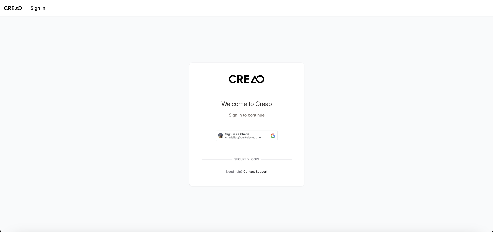

# Set Up Your Account

Welcome to Creao AI! Follow these simple steps to set up your account and start creating powerful workflows.

---

## 1. 🔑 Sign In with Google

1. Navigate to the CREAO Homepage
   Click on the Sign in with Google button and approve the requested permissions in the Google pop-up window.

2. Access Dashboard
   Once authenticated, you’re redirected to the CREAO main dashboard. From here, you can create new projects, manage environments, and more. 🥳

Check out next page to create your first workflow.
