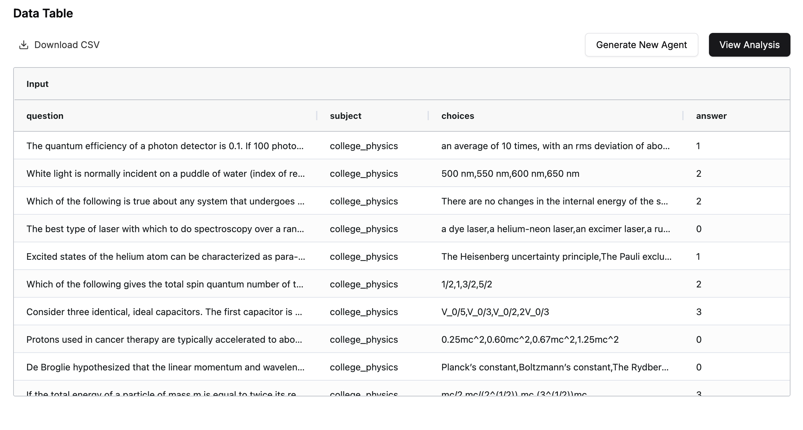

# 📊 Data Tab

After creating a project, you'll be redirected to the **Data** tab. This is where you can view and analyze the dataset you uploaded. The page provides a preview of your data, as well as the responses generated by each agent based on that data.

## 🔍 Understanding the Data Table

The data table is the main feature on this page, and it is organized into the following sections:

1. 📥 **Input Columns**

   - Located on the left side of the table
   - Contains the dataset you uploaded

2. 📤 **Output Columns**

   - Located on the right side
   - Will display the responses generated by the agents

3. 💾 **Download Option**

   - The entire data table can be downloaded as a CSV file

### 📎 How the Table Works

- Initially, when you open the page, the input columns will be populated with the dataset you uploaded.
- The output columns will be empty because the agents haven't been generated yet.
- Once you've created an agent, the output columns will be populated with the agent's responses.

> 💡 **Next Step**: To begin generating responses and filling the output columns, let's head over to the **Settings** tab. There, you can configure a new agent to start processing the data.
