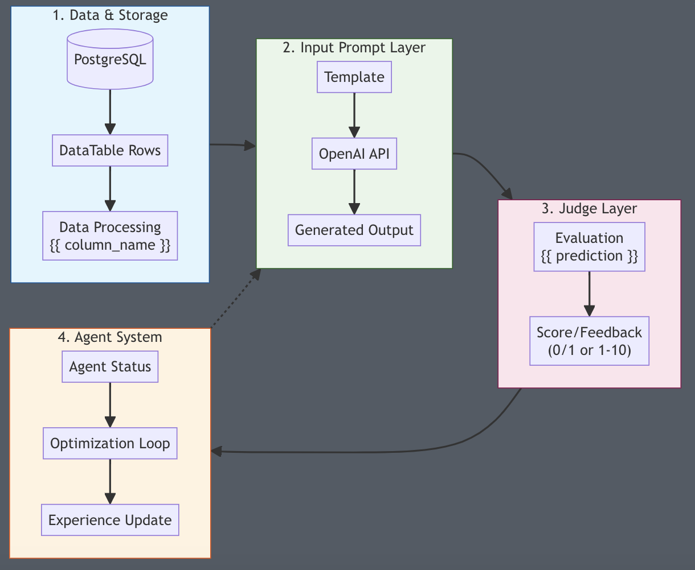

# 🛠️ Settings Tab

## 🌟 Introduction - Understanding and Using Input & Judge Prompts in Creao AI

Input and Judge prompts are the foundation of Creao AI's intelligent workflow system. They work together to create a powerful feedback loop that enables continuous improvement of your AI agents.

## Core Concepts

### What are Input & Judge Promts?

- **Input Prompt**: A template that instructs the AI how to generate outputs from your data
- **Judge Prompt**: A template that defines how to evaluate the quality of generated outputs

Think of them as:

- Input Prompt = "Here's how to do the task"
- Judge Prompt = "Here's how to evaluate if it was done well"

# 🔄 How Input & Judge Prompts Work

## Understanding the Flow



## Writing Effective Prompts 📝

### Input Prompt

```
Based on {{ product_name }} and {{ price }},
create a marketing tagline that:
1. Highlights key features
2. Matches price point
3. Appeals to target market

```

Key Points:

- Clear instructions
- Specific requirements
- Uses data variables
- Defined structure

### Judge Prompt

```
Rate this tagline {{ prediction }} on:
1. Accuracy (matches {{ product_name }})
2. Value (reflects {{ price }})
3. Appeal (1-10 score)

Provide score and brief feedback.

```

Key Points:

- Clear criteria
- Numerical scoring
- Uses prediction
- Structured feedback

## Creating Effective Prompts 📝

### Input Prompt Structure

```
1. Context: What data to use
2. Task: What to create
3. Requirements: Specific formats or rules
4. Variables: Your data columns in {{ }}

```

### Judge Prompt Structure

```
1. Reference: What to compare against
2. Criteria: How to evaluate
3. Scoring: Clear scoring guidelines
4. Format: Required output format

```

## Common Use Cases and Examples💡

### 1. Content Generation

**Input Prompt:**

```
Create product content using:
Product name: {{ product_name }}
Features: {{ features }}
Price: {{ price }}

Generate a compelling description focusing on value proposition.

```

**Judge Prompt:**

```
Evaluate this content {{ prediction }} based on:
1. Accuracy (matches {{ features }})
2. Value communication (relative to {{ price }})
3. Engagement

Rate each aspect 1-10.

```

### 2. Multiple Choice Questions

**Input Prompt:**

```
Question: {{ question }}

Options:
0) {{ choices[0] }}
1) {{ choices[1] }}
2) {{ choices[2] }}
3) {{ choices[3] }}

Select the correct answer number (0-3).

```

**Judge Prompt:**

```
Reference: {{ answer }}
Prediction: {{ prediction }}

Score 1.0 if correct, 0.0 if incorrect.

```

### 3. Analysis Tasks

**Input Prompt:**

```
Analyze this data:
Revenue: {{ revenue }}
Costs: {{ costs }}
Growth: {{ growth_rate }}

Provide key insights and recommendations.

```

**Judge Prompt:**

```
Rate analysis {{ prediction }} on:
1. Calculation accuracy
2. Insight depth
3. Recommendation quality

Score each 1-5 with explanation.

```

# Quick Guide to Writing Effective Prompts

## Best Practices 🎯

### Input Prompts

1. **Be Clear & Specific**
   - State what you want
   - Define output format
   - Use examples when needed
2. **Use Data Smart**
   - Use `{{ column_name }}` for your data
   - Check your variables exist
   - Keep naming consistent

### Judge Prompts

1. **Keep Scoring Simple**
   - Binary: Use 0 or 1
   - Scale: Use 1-5 or 1-10
   - Define what each score means
2. **Make Feedback Useful**
   - Clear scoring criteria
   - Objective evaluation
   - Consistent standards

## Common Issues & Quick Fixes 🔧

1. **Bad Outputs?**
   → Add example format in prompt
2. **Poor Scoring?**
   → Use number scores instead of words
3. **Missing Info?**
   → Check all needed variables are in prompt

Need help? Check our example templates or ask support!
