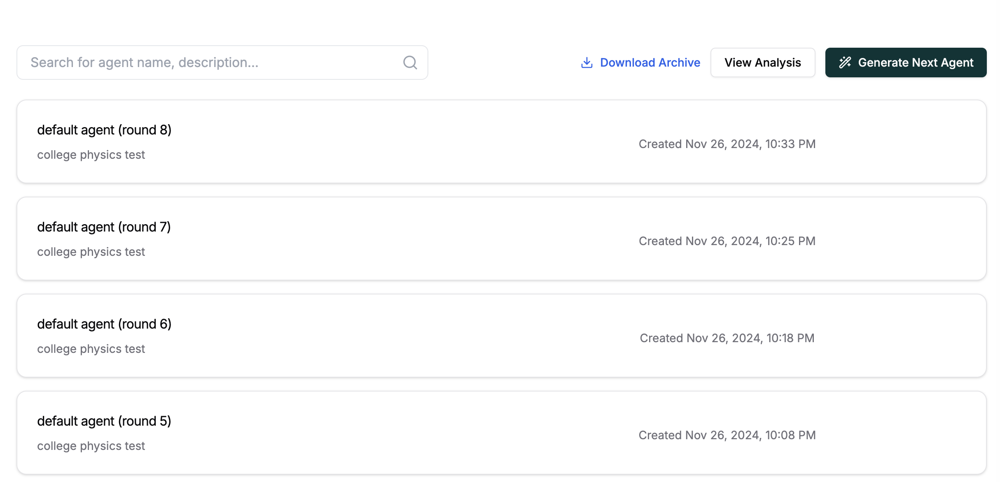
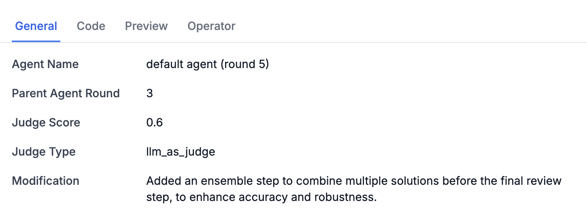
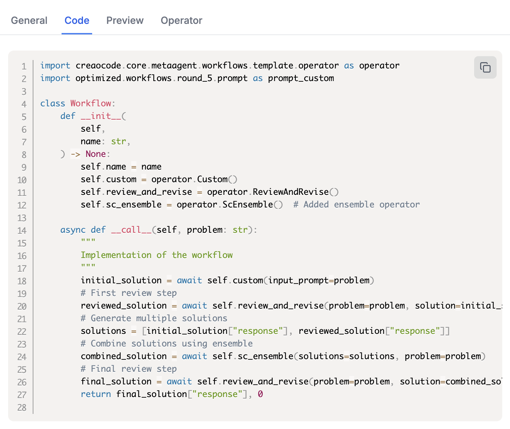
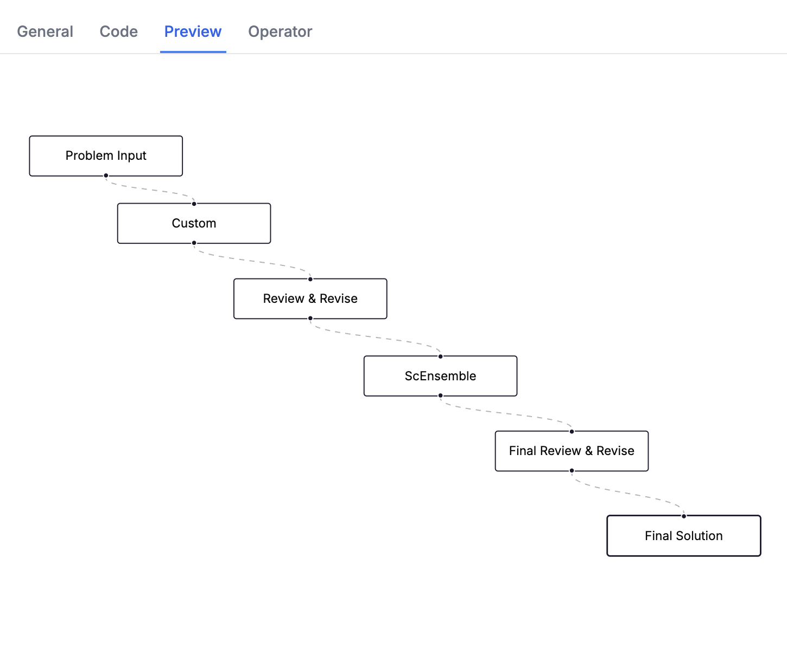

# 🧑‍💻 Agent Tab

The **Agent** tab is where you can manage and monitor your AI agents. This page allows you to generate new agents, view their details, and track their performance.

The Agent page consists of the following:

1. 📋 **Agent Cards**
   - Shows agent name, description, and creation time
   - Status indicators:
     - 🔄 Arrow: Agent is being generated
     - ⚙️ Cog: Agent is in reflection mode. Can be viewed, but not completed.
     - ⚠️ Red triangle: Invalid agent
     - No icon: Agent is ready to use!
2. 📊 **Agent Details Sidebar**
   The sidebar opens when clicking an agent card and has four tabs:

   - **General**: Basic information about the agent
     

   - **Code**: The agent's Python code
     

   - **Preview**: Visual representation of the agent's workflow
     

   - **Operator**: Technical details about the agent's operators
     

### ⚪️ Agent Status

- **🔄 PENDING**: Agent is currently being generated
- **⚙️ REFLECTION**: Agent is analyzing and optimizing its approach
- **🟢 ACTIVE**: Agent is fully functional and ready to use
- **🔴 INACTIVE**: Agent is invalid or has encountered an error

### 💫 How It Works

1. **Generating Agents**

   - Click the "Generate Next Agent" button to create a new agent
   - The system will automatically optimize based on previous agents
   - New agents will appear with a "PENDING" status while being generated

2. **Managing Agents**
   - When an agent has finished generating, click on it to view more details
   - Download complete agent data using the Archive button
   - View detailed analysis through the Analysis button

> 💡 **Note**: Make sure you've configured the Input and Judge Prompt Templates in the Settings tab before generating agents first. These templates can be updated at any time.

### 📈 Performance Tracking

Each agent includes performance metrics:

- Judge scores for evaluating effectiveness
- Parent-child relationships between agents
- Modification history showing improvements

> 💡 **Next Step**: Let's look at even more metrics by heading to the Analysis tab
