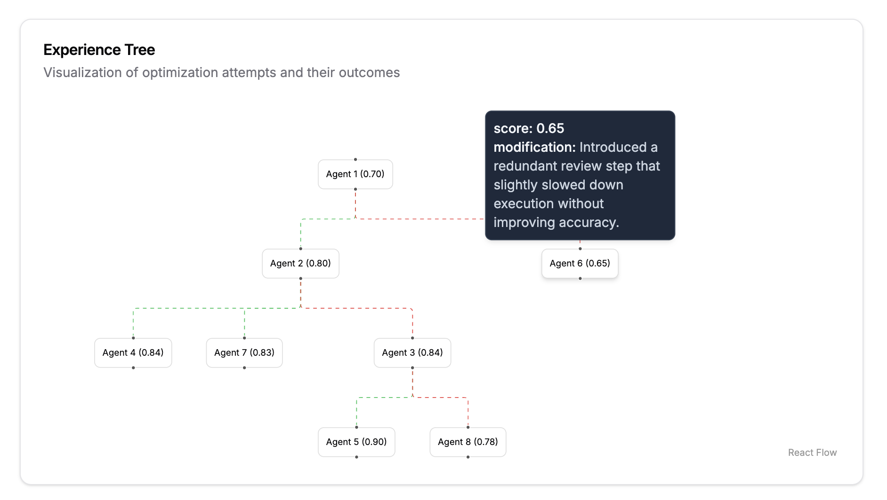
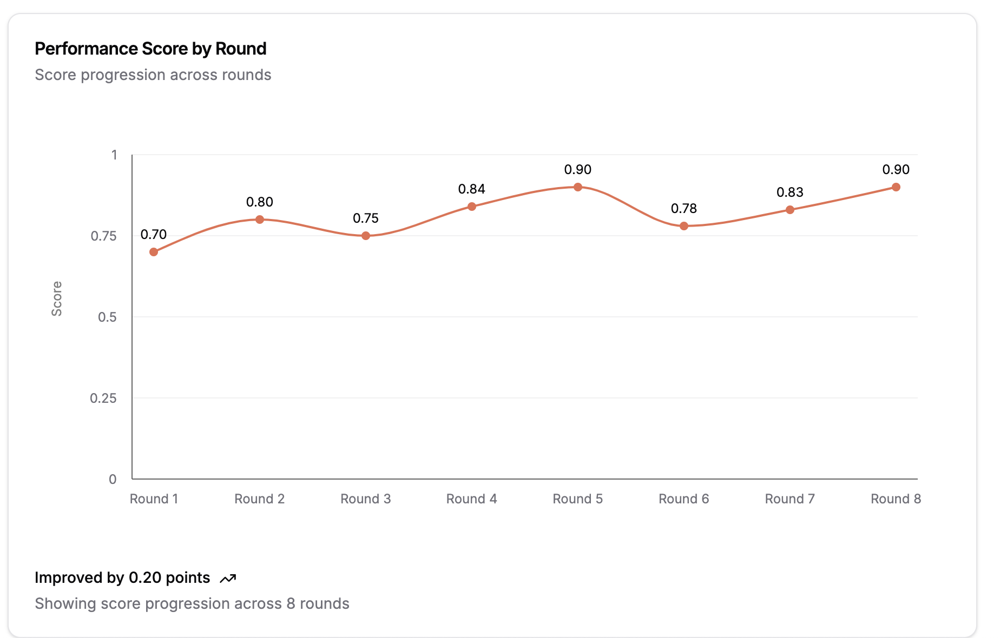

# 📈 Analysis

The **Analysis** tab provides detailed visualizations and metrics to help you understand your agents' performance and optimization journey.

> 💡 **Note**: At least one new agent must be generated before the Analysis page will be available.

## Key Components

The Analysis page features two powerful visualization tools:

### 1. 🌳 Experience Tree

A hierarchical visualization of your agent optimization journey:

- **Nodes**: Each circle represents a unique agent
- **Connections**: Lines show parent-child optimization relationships
- **Color Coding**:
  - Green: Improved agents
  - Red: Regressed agents
- **Interactive Features**:
  - Hover over nodes to view agent details
  - Zoom and pan to explore complex trees

### 2. 📊 Performance Score Chart

A temporal view of agent performance:

- **X-axis**: Optimization rounds/iterations
- **Y-axis**: Performance score

## Using the Analysis Tools

1. **Identify Patterns**: Use the Experience Tree to spot which optimization paths yield the best results
2. **Track Progress**: Monitor performance trends in the Score Chart
3. **Compare Agents**: Select multiple agents to analyze their relative performance

Look for branches in the Experience Tree that consistently show improvement to identify successful optimization strategies.

> 💡 **Next Step**: Use these insights to refine your prompts and settings for better agent performance
